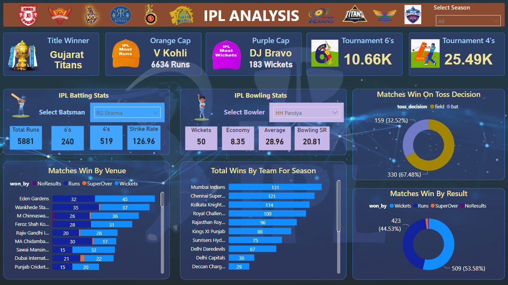

# IPL-Analysis-Dashboard
IPL Analysis Dashboard using Power BI and mysql   
                                                                                                                      
Steps followed:                                                                                                                                                          
-Requirement gathering                                                                                                                                                   
-Stakeholders in project                                                                                                                                                 
-Import data in MS SQL server                                                                                                                                            
-Connecting Power BI to database                                                                                                                                         
-Data Cleaning                                                                                                                                                           
-Data Processing                                                                                                                                                         
-Time Intelligence Function                                                                                                                                              
-Data Visualization                                                                                                                                                     
-Creating Dashboard                                                                                                                                                      
-Generation Insights     

Stakeholders:                                                                                                                                                          
-BCCI                                                                                                                                                                  
-Franchise/Team owner                                                                                                                                                  
-Coaches                                                                                                                                                               
-Players                                                                                                                                                               
-Media                                                                                                                                                                 
-Public                                                                                                                                                                

Power BI functionalities used:                                                                                                                                         
-Connect Power BI to sql server                                                                                                                                        
-Data Modelling with 3 tables                                                                                                                                          
-Data cleaning in power query                                                                                                                                          
-Time Intelligence Function                                                                                                                                            
-Creating KPI's                                                                                                                                                        
-DAX Queries                                                                                                                                                           
-Creating and Formatting Charts                                                                                                                                        
-Creating different shapes and formatting                                                                                                                              
-Generating Insights from charts                                                                                                                                       
-Export Report

